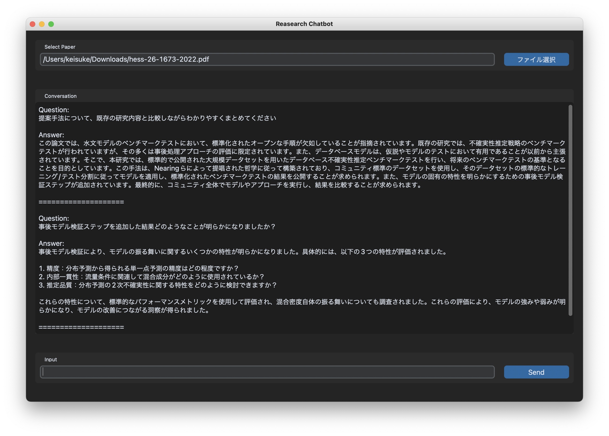

# Research-ChatBot

## Install Guide
- research_chatbot.pyの最後のYOUR_API_KEYを自身のOpenaiのAPI keyを設定してください
```shell
pip install -r requirements.txt
python research_chatbot.py
```

## How to use
1.  参照ボタンから、質問したい論文のPDFファイルを選択する
2.  論文の読み込みが終わったら、入力箇所から質問する

